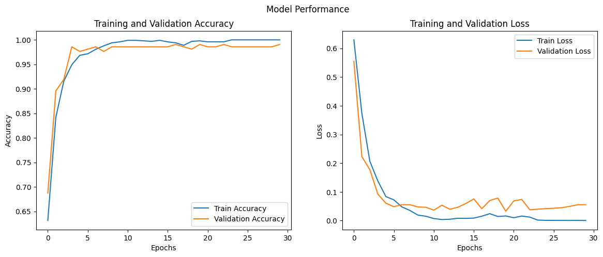
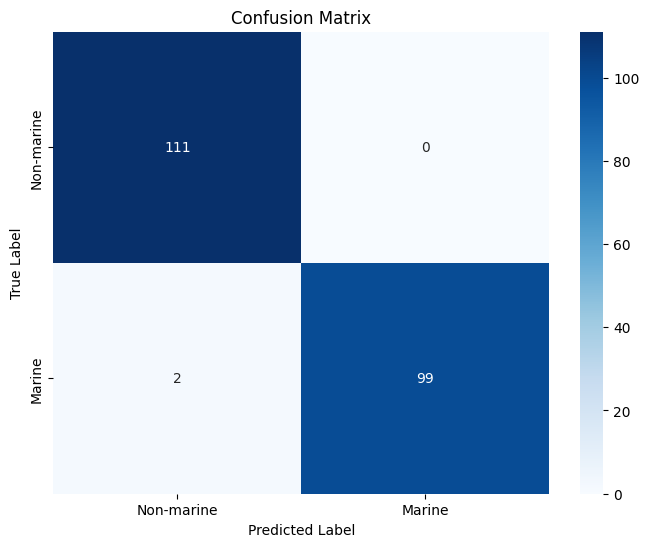

# Marine Audio Classification using CNNs

## Overview

This project involves the development of a Convolutional Neural Network (CNN) model for the classification of marine and non-marine animal sounds. Using a high-quality dataset from the Watkins Marine Mammal Sound Database, our model achieves an accuracy of 99.06% and an F1-score of 0.99, showcasing significant potential for ecological monitoring and conservation efforts. It offers a non-invasive yet effective method to study marine ecosystems and their inhabitants.

## Installation

Clone this repository using:
git clone https://github.com/ts3164/marine-audio-classification.git

## Dataset

The dataset comprises 1,408 audio segments derived from 1,051 WAV files, with 667 marine and 384 non-marine animal sounds. The audio for marine mammals was sourced from the Watkins Marine Mammal Sound Database, and the non-marine sounds were from diverse global animal datasets.

## Preprocessing & Annotation

Preprocessing steps included audio normalization to 22,050 Hz and spectrogram generation with a resolution of 128×128 pixels. A detailed annotation process is outlined in the 'Directions for Audio Annotations.pdf', ensuring the isolation of each animal calls for signal clarity. Preprocessing ensured the sounds were devoid of background noise and standardized for CNN input.

## Model Architecture

The CNN model utilizes multiple convolutional and max pooling layers, ReLU activations, batch normalization, and dropout for binary classification. It is optimized using the Adam optimizer and trained with early stopping to prevent overfitting.

## Results

The model distinguishes between marine and non-marine sounds with high precision, as indicated by the confusion matrix and ROC curve analysis. These results demonstrate the model's potential applicability in various research fields. Our model achieves an accuracy of 99.06% and an F1-score of 0.99. 

### Visuals in Results

The confusion matrix and ROC curve graphics are integral to the results section. These visuals, including `ROCoutput.png` and `confusion-matrix.png`, showcase the model's performance.

## Directions for Use

- Follow the 'Directions for Audio Annotations.pdf' for audio preprocessing guidelines.
- To train the model with your dataset, modify the paths in the code to your local environment.

## Contributions

Tiffany Sentosa and Ina Leung from Columbia University have contributed to the dataset collection, annotations, code base, documentation, and writing of the research paper.

## Acknowledgements

Special thanks to Professor Carl Vondrick for guidance, Oceanographer Emeritus William A. Watkins for his recordings, and Cornell’s Lab of Ornithology for providing access to Raven Pro software.

## Citation

Please refer to the 'CVPR-marine-audio-classification-paper.pdf' for citation formats and a detailed research background.

---

*Note: The full instructions for preprocessing and model training can be found in the respective PDF guides included in the repository.*

